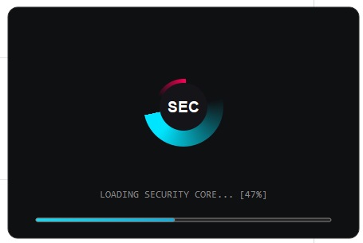

# 🔒 Encryption Studio 

**Encryption Studio** 是一个基于 Python 和 PySide6 开发的高级本地文件安全防御系统。它提供现代化的图形界面，支持大文件智能分块加密、文件名混淆、多线程批量处理以及多种文本加密算法。

> **注意!**：本项目为离线版本，所有加解密操作均在本地完成，无数据上传风险。

## 📦 分发与使用教程 (Deployment)

本项目支持两种分发方式，用户可根据需求选择。

### 1. 文件夹模式 (推荐 / Recommended)
**文件名**：`EncryptionStudio_V1.0.7z` (压缩包)

* **特点**：启动速度极快（秒开），运行稳定，包含完整的依赖文件。
* **如何使用**：
    1. 下载 `EncryptionStudio_V1.0.7z` 压缩包。
    2. 将其解压到任意文件夹（**⚠️ 注意：必须解压，不能直接在压缩包内运行**）。
    3. 进入解压后的文件夹，双击运行 `EncryptionStudio_V1.0.exe`。
    4. 程序会自动在同级目录下生成 `Logs`（日志）和 `Keys`（密钥）文件夹，请勿随意删除。

### 2. 单文件模式 (便携 / Portable)
**文件名**：`EncryptionStudio_V1.0.exe` (独立程序)

* **特点**：只有一个文件，方便拷贝和分享，无需解压。
* **如何使用**：
    1. 直接双击 `EncryptionStudio_V1.0.exe` 运行。
    2. **注意**：首次启动可能需要等待 3-5 秒（程序正在自解压到内存），请耐心等待，不要重复点击。
    3. 程序运行后，会自动在 `.exe` 文件旁边生成配置文件夹。建议将程序放在一个专门的文件夹中运行，以免生成的文件显得杂乱。

## ✨ 核心功能 (Key Features)

* **⚡ 智能分块策略 (Smart Chunking)**
    * 无需手动设置，系统根据文件大小自动计算最佳分块（64KB - 10MB），在保证速度的同时极低占用内存，轻松处理 GB 级大文件。
* **🛡️ 企业级安全防护**
    * 采用 **AES-256 (CBC模式)** 工业级加密标准。
    * **文件名混淆 (Filename Obfuscation)**：加密后文件名变为随机乱码（如 `a1b2.enc`），解密时自动还原原始文件名，防止元数据泄露。
* **🚀 多线程批量处理**
    * 支持拖拽添加数百个文件，多线程队列执行，界面流畅不卡顿。
    * 支持任务队列管理（添加、移除、清空）。
* **📂 灵活的文件管理**
    * **原地加密/解密**：默认将结果生成在源文件同级目录，方便查找。
    * **源文件保护**：提供“完成后物理删除源文件”选项（默认关闭，需手动确认）。
* **🎨 现代化 UI 设计**
    * IDE 风格的极速启动动画。
    * 深色模式，扁平化控件，自适应布局。
* **📝 附带工具箱**
    * 实时系统日志监控。

## 📸 界面预览 (Screenshots)

|           启动动画           |            批量加密            |
|:------------------------:|:--------------------------:|
|  |  |

## 🛠️ 安装与运行 (Installation)

### 环境要求
* Python 3.10.10 或更高版本
