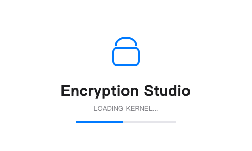
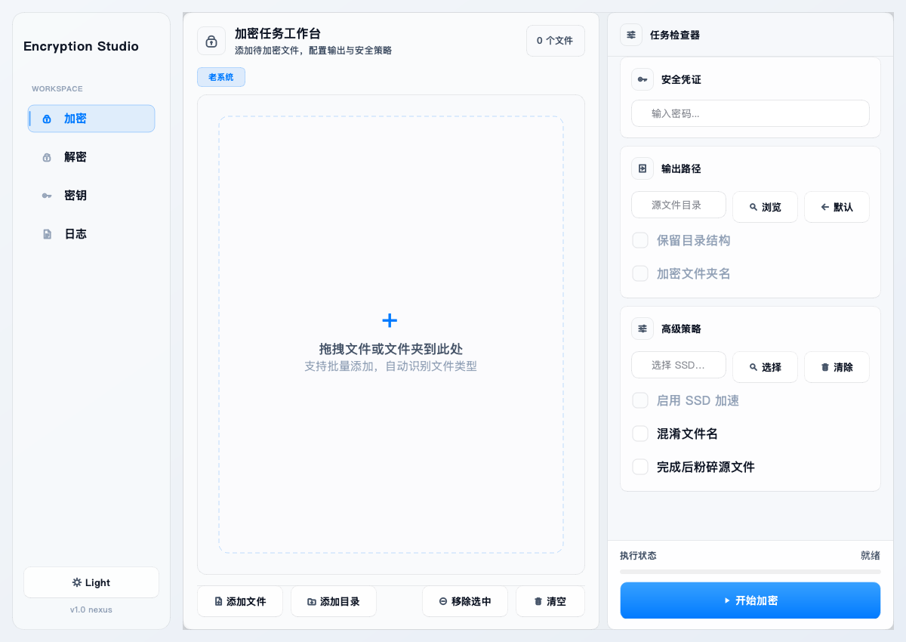
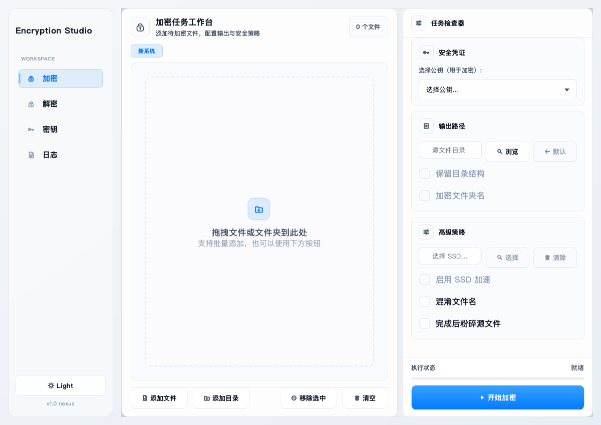
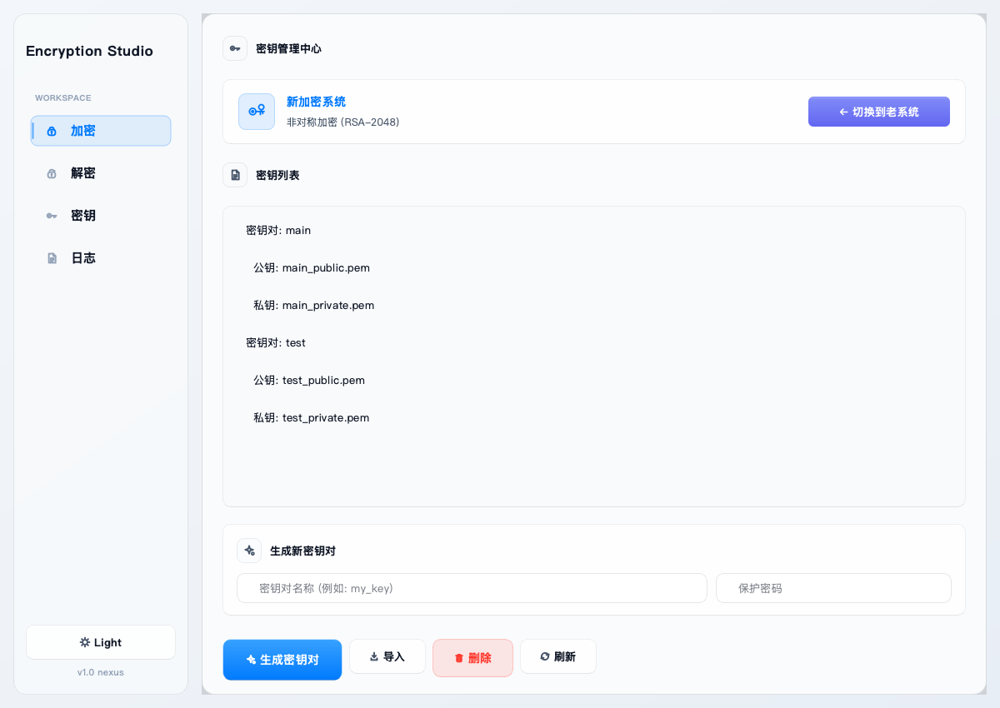

# 🔒 Encryption Studio
`nexus branch`

**Encryption Studio** 是一个基于 Python 和 PySide6 开发的高级本地文件安全防御系统。它提供现代化的图形界面，支持**新旧两套加密系统**、大文件智能分块加密、文件名混淆、多线程批量处理以及系统托盘最小化。

> **注意!**：本项目为离线版本，所有加解密操作均在本地完成，无数据上传风险。

## 🆕 新特性 (nexus 分支)

* **双加密系统**
    * **老系统 (对称加密)**：使用 AES-256-CBC，用户输入密码即可加密/解密，简单快速
    * **新系统 (非对称加密)**：使用 RSA-2048 密钥对，私钥用密码保护，更安全可靠
    * 可在密钥管理页面一键切换，加密/解密界面实时显示当前系统
* **增强的安全性**
    * 文本加密升级为 PBKDF2 密钥派生（200,000 迭代），替代旧的 SHA256
    * 自动向后兼容旧版本加密文件
    * 改进的异常处理和错误提示
* **密钥管理中心**
    * 生成 RSA-2048 密钥对，私钥用密码加密保护
    * 导入/导出密钥对（公钥+私钥）
    * 密钥列表管理，支持删除操作
* **现代化UI设计**
    * 简洁的苹果风格界面
    * 两种主题：Light（浅色）、Dark（深色）
    * 流畅的启动动画和主题切换效果
    * 圆角窗口和卡片式布局
* **系统托盘支持**：最小化到系统托盘，支持快捷操作菜单
* **增强日志系统**：记录每一步操作细节，包括文件路径、加密参数、成功/失败状态
* **模块化代码架构**：UI组件、主题、工具函数分离，代码更清晰

## 📦 分发与使用教程 (Deployment)

本项目支持两种分发方式，用户可根据需求选择。

### 1. 文件夹模式 (推荐 / Recommended)
**文件名**：`EncryptionStudio_V1.x.7z` (压缩包)

* **特点**：启动速度极快（秒开），运行稳定，包含完整的依赖文件。
* **如何使用**：
    1. 下载 `EncryptionStudio_V1.x.7z` 压缩包。
    2. 将其解压到任意文件夹（**⚠️ 注意：必须解压，不能直接在压缩包内运行**）。
    3. 进入解压后的文件夹，双击运行 `EncryptionStudio_V1.x.exe`。
    4. 程序会自动在同级目录下生成 `Logs`（日志）和 `Keys`（密钥）文件夹，请勿随意删除。

### 2. 单文件模式 (便携 / Portable)
**文件名**：`EncryptionStudio_V1.x.exe` (独立程序，但是不推荐，可能存在bug)

* **特点**：只有一个文件，方便拷贝和分享，无需解压。
* **如何使用**：
    1. 直接双击 `EncryptionStudio_V1.x.exe` 运行。
    2. **注意**：首次启动可能需要等待 3-5 秒（程序正在自解压到内存），请耐心等待，不要重复点击。
    3. 程序运行后，会自动在 `.exe` 文件旁边生成配置文件夹。建议将程序放在一个专门的文件夹中运行，以免生成的文件显得杂乱。

## ✨ 核心功能 (Key Features)

* **🔐 双加密系统**
    * **老系统**：AES-256-CBC 对称加密，输入密码即可使用，简单快速
    * **新系统**：RSA-2048 非对称加密，生成密钥对文件，私钥用密码保护，安全性更高
    * 在密钥管理页面一键切换，加密/解密界面实时显示当前系统
    * 新系统使用混合加密：RSA 加密 AES 密钥，AES 加密文件内容，兼顾安全性和性能
* **⚡ 智能分块策略 (Smart Chunking)**
    * 无需手动设置，系统根据文件大小自动计算最佳分块（64KB - 10MB），在保证速度的同时极低占用内存，轻松处理 GB 级大文件。
* **🛡️ 企业级安全防护**
    * 老系统：采用 **AES-256 (CBC模式)** 工业级加密标准。
    * 新系统：采用 **RSA-2048** 非对称加密，密钥对分离存储。
    * **文件名混淆 (Filename Obfuscation)**：加密后文件名变为随机乱码（如 `a1b2.enc`），解密时自动还原原始文件名，防止元数据泄露。
* **🚀 多线程批量处理**
    * 支持拖拽添加数百个文件，多线程队列执行，界面流畅不卡顿。
    * 支持任务队列管理（添加、移除、清空）。
* **📂 灵活的文件管理**
    * **原地加密/解密**：默认将结果生成在源文件同级目录，方便查找。
    * **源文件保护**：提供”完成后物理删除源文件”选项（默认关闭，需手动确认）。
    * **目录结构保持**：支持保留原始文件夹结构，可选加密文件夹名。
    * **SSD 加速**：支持使用高速固态硬盘作为临时缓存，提升大文件处理速度。
* **🎨 现代化 UI 设计**
    * 流畅的启动动画和过渡效果
    * 两种主题可选：Light（浅色）、Dark（深色）
    * 简洁的苹果风格设计，圆角卡片布局
    * 自定义复选框和按钮动画效果
    * 系统托盘支持，最小化到托盘，快捷菜单操作
* **🔑 密钥管理中心**
    * 老系统：直接输入密码，无需管理密钥文件
    * 新系统：生成和管理 RSA 密钥对，私钥用密码加密保护
    * 支持导入密钥对（同时选择公钥和私钥文件）
    * 密钥列表显示和删除功能
* **📝 完整日志审计**
    * 实时系统日志监控。
    * 记录每一步操作：文件添加、路径选择、加密参数、成功/失败状态。

## 📸 界面预览 (Screenshots)


| 启动动画 | 加密工作台 |
|:---:|:---:|
|  |  |

| 新系统加密 | 密钥管理 |
|:---:|:---:|
|  |  |

## 🛠️ 安装与运行 (Installation)

### 环境要求
* Python 3.10+ 或更高版本
* 支持的操作系统：Windows、macOS、Linux

### 依赖安装
```bash
pip install -r requirements.txt
```

主要依赖：
- `PySide6` - Qt6 GUI 框架
- `cryptography` - 加密库（RSA、AES）

### 运行程序
```bash
python main.py
```


